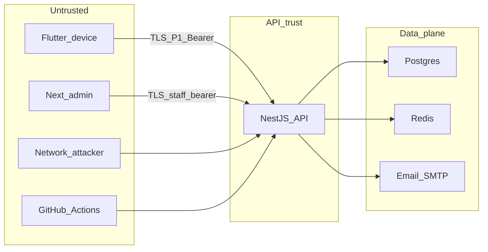

# Threat model

Tài liệu sống — `SEC-P0-001`. Catalog kiểm soát: [security.md](security.md). Review trước phát hành: [security-review.md](../process/security-review.md).

Cập nhật khi thêm bề mặt (endpoint, client, bên thứ ba) hoặc trước gate phase. Không nhét payload exploit / PoC tấn công vào repo.

## Quy ước

- Phương pháp: **STRIDE** (Spoofing, Tampering, Repudiation, Information disclosure, Denial of service, Elevation of privilege).
- Phase 0 và auth Phase 1 = as-built; phần Phase 1 còn lại = planned (task ID, chưa ship).
- Mitigation ghi control đã có **hoặc** task còn mở. Không bịa đối tác, region, hay IAP.
- Local compose không phải production.

## Actor

| Actor | Mô tả |
|---|---|
| End user | Chủ tài khoản trên Flutter. |
| Staff admin | Nhân viên nội bộ; role `staff` trên cùng API. Không phải user. |
| Attacker mạng | Không auth; quét API, giả origin, brute-force (P1). |
| Attacker thiết bị | Máy mất / mượn; đọc số dư, session trên client. |
| Staff độc hại / tài khoản staff lộ | Tra cứu PII ngoài nhu cầu hỗ trợ. |
| Developer local | Máy dev, credential compose. |
| CI | GitHub Actions; đọc repo, secret CI khi có. |

Ngoài P0/P1: bank partner (Phase 6), crash SaaS (`INF-P1-001` / DECISIONS-OPEN #9).

## Trust boundaries

- Device / admin / internet → API: TLS (staging/prod). Local HTTP chấp nhận được.
- Cùng API cho mobile và admin; phân tách bằng role, không bằng host riêng.
- API → Postgres / Redis / SMTP: mạng nội bộ hoặc secret URL; không lộ ra client.
- Compose local (`:5434`, Redis không auth, Mailhog) **không** deploy ra internet.
- CI không trỏ prod DB ([environments.md](../infrastructure/environments.md)).

## Asset

Khớp [security.md](security.md) và [data-model.md](data-model.md).

| Asset | Ví dụ | Ghi chú |
|---|---|---|
| Dữ liệu tài chính | GD, số dư derived, ví, FX | Prisma đã có; CRUD Phase 1 |
| PII | `User.email`, tên (P1 hồ sơ) | Không log đầy đủ |
| Session / secret | Bearer, cookie, JWT, DB URL | Opaque session + hashed email token + encrypted outbox (`BE-P1-001`, `BE-P1-002`) |
| Device lock | PIN / biometric | Client, `MOB-P1-001` |
| Bank token | — | Phase 6; chưa có |

## Bề mặt Phase 0 (as-built)

Chỉ những gì đang chạy.

| Surface | Ghi chú |
|---|---|
| `GET /api/health` | Unauth. Trả `status`, `service`, `timestamp`, `database` up/down. |
| Nest `:4000` | Helmet, CORS `CORS_ORIGINS`, ValidationPipe whitelist + `forbidNonWhitelisted`. Prefix `/api`. |
| Compose Postgres `:5434` | User/password dev `freeva`/`freeva`. Chỉ local. |
| Redis `:6379` | Không AUTH trên compose. Chỉ local. |
| Mailhog `:1025` / `:8025` | Fake SMTP + UI. Không dùng prod. |
| Web admin `:3001` | Health + form tra cứu chính xác email/UUID. Credential nhập dạng password cho từng request, không lưu URL/local storage. |
| `POST /api/admin/user-lookups` | Bearer staff từ env (tối thiểu 32 ký tự), trả hồ sơ tối thiểu, không dữ liệu tài chính. Thiếu/sai config thì fail closed. |
| Flutter shell | Splash + home. Chưa gọi API. |
| Logger Pino | Redact nested 1–2 cấp (`pino-redact.ts`). Checklist: [pii-log-checklist.md](pii-log-checklist.md) (`SEC-P0-003`). |
| Git / CI / `.env.example` | Secret không commit ([secrets.md](../infrastructure/secrets.md)). Prod secret manager TBD. |
| OpenAPI | Public trong repo; health, staff lookup và auth/session Phase 1. |
| Prisma schema | Bảng User/ví/GD đã migrate local; không có HTTP CRUD. |
| Audit schema/writer | `BE-P0-004`: schema đã kiểm chứng. `WA-P0-002`: writer hẹp `staff.user_lookup`, fail closed nếu ghi audit lỗi. Chưa writer event khác hoặc chống sửa/xóa. [ADR 008](adr/008-audit-event-schema.md). |

## Bề mặt Phase 1 (planned)

Các hàng dưới còn planned; auth/session đã triển khai được ghi riêng bên dưới.

| Surface | Task |
|---|---|
| Google/Apple OAuth (Should) | `BE-P1-003` |
| PIN / biometric lock app | `MOB-P1-001` |
| CRUD ví + số dư ban đầu | `BE-P1-004`, `MOB-P1-003` |
| CRUD GD thu/chi/transfer cân bằng | `BE-P1-005`, `MOB-P1-004`, `QA-P0-002` |
| Danh mục | `BE-P1-006`, `MOB-P1-005` |
| Báo cáo / search | `BE-P1-007`, `BE-P1-008` |
| Sync queue, idempotency `clientId` | `BE-P1-009`, `MOB-P1-008` |
| Export JSON + xóa tài khoản | `BE-P1-010` |
| Ẩn số dư khi nền; cảnh báo thiết bị mới (Should) | `MOB-P1-009` |
| Crash monitoring staging | `INF-P1-001` |
| Security test trước store | `SEC-P1-001` |
| Ghi audit thực tế cho export / xóa | `BE-P1-010`; schema nền `BE-P0-004` đã có, lookup staff đã tích hợp trong `WA-P0-002` |

Auth user: Bearer (`/api/v1` khi gắn Phase 1). Admin P0 dùng opaque Bearer secret ánh xạ một staff UUID; mobile không nhúng API secret.

## STRIDE

| ID | Cat | Surface | Threat | Mitigation |
|---|---|---|---|---|
| T-S01 | S | API P1 | Giả danh user (credential stuffing, session đánh cắp) | Đã có Argon2id, email verification độc lập với login, DB session 7 ngày, revoke tức thời ở request tiếp theo, reset thu hồi toàn bộ. [ADR 009](adr/009-email-auth-sessions.md). |
| T-S02 | S | Mobile | Mở app trên máy người khác | `MOB-P1-001` PIN/biometric. P0: chưa lock. |
| T-S03 | S | Admin | Giả staff / đánh cắp shared credential | Role `staff` ≠ user; Bearer token tối thiểu 32 ký tự, timing-safe compare, header redact, actor UUID từ server env. Single-staff credential P0 phải rotate khi nghi lộ và thay bằng identity/session/revoke trước production. |
| T-T01 | T | CRUD GD P1 | Sửa số tiền / transfer lệch / IDOR `userId` | Isolation theo `userId`. Transfer hai leg cân bằng — `BE-P1-005`, `QA-P0-002`. ValidationPipe đã chặn field lạ P0. |
| T-T02 | T | Sync P1 | Trùng hoặc ghi đè GD khi offline | `clientId` unique `(userId, clientId)`, `version` — `BE-P1-009`. Rủi ro R2. |
| T-T03 | T | Compose | Đổi data local nếu port bind máy | Chấp nhận local. Không bind compose ra internet; không trỏ local vào prod DB. |
| T-R01 | R | API / admin | Thao tác PII không truy vết | Auth success register/verify/login/reset/revoke ghi audit trong cùng transaction. Lookup staff ghi `staff.user_lookup` cho success/không tìm thấy và không trả PII nếu audit fail (`WA-P0-002`). Bảng chưa append-only; export/xóa còn `BE-P1-010`. |
| T-R02 | R | Export / xóa TK | User phủ nhận yêu cầu xóa / xuất | `BE-P1-010` phải ghi event trên schema `BE-P0-004`; chưa tích hợp. |
| T-I01 | I | `GET /api/health` | Lộ DB up/down (recon) | Chấp nhận P0 (ops local). Review ẩn chi tiết trước staging công khai. |
| T-I02 | I | Logger | Email, token, số tiền, số TK trong log | Pino nested paths (`BE-P0-003`, `pino-redact.ts`). Checklist [pii-log-checklist.md](pii-log-checklist.md) (`SEC-P0-003`). Không nội suy PII vào message. |
| T-I03 | I | Analytics | PII trong event | Catalog cấm email/số dư/số TK — `MOB-P0-004`. |
| T-I04 | I | Mobile | Số dư lộ khi app nền / screenshot | `MOB-P1-009`. |
| T-I05 | I | Export | File xuất chứa PII trên thiết bị mất | `BE-P1-010` + app lock. Privacy: [privacy-compliance.md](privacy-compliance.md). |
| T-D01 | D | `GET /api/health` | Flood health / mở connection DB | P0: chấp nhận local. P1 staging: rate limit / tách liveness không đụng DB nếu cần. |
| T-D02 | D | Login P1 | Brute-force / OTP spam | Đã có atomic PostgreSQL rate limit 30/IP + 5/email/operation/15 phút, trước hash/validation; Retry-After, storage lỗi fail closed. |
| T-E01 | E | Admin | Staff thấy dữ liệu user hoặc dashboard KD | Endpoint staff chỉ exact lookup, response hồ sơ tối thiểu, không số dư/GD/list tổng; **không** dashboard kinh doanh P0. Shared role chưa phân quyền chi tiết. |
| T-E02 | E | API P1 | User A đọc/ghi resource user B | Mọi query user-owned lọc `userId`. OpenAPI + guard Phase 1. |

## Ngoài phạm vi P0/P1

- Kết nối ngân hàng / bank token (Phase 6; cần DPA + threat model RBAC).
- AI / OCR (Phase 5).
- CRDT; sync MVP = queue + last-write-wins ([sync.md](sync.md)).
- Pentest nội bộ bằng payload trong git ([security-review.md](../process/security-review.md)).
- Web consumer (không phải admin).

## Rủi ro dư

| Mục | Xử lý |
|---|---|
| `GET /api/health` unauth + `database` | Chấp nhận P0. Cắt hoặc tách endpoint trước staging public. |
| Redis compose không AUTH | Chỉ local. Prod: AUTH + không expose port. |
| Staging Render/Vercel | Stack chốt; provision `INF-P0-004`. Staging có thể Singapore (Render); prod region VN. |
| Region dữ liệu chốt VN | DECISIONS-OPEN #5 (2026-09-18). Vendor hosting production vẫn TBD tới Store. |
| Crash SaaS (Sentry dự kiến; chưa SDK) | Residual P0 chấp nhận 2026-09-21; DECISIONS-OPEN #9; wiring `INF-P1-001`. |
| `security@` TBD | DECISIONS-OPEN #10. |
| Sync trùng GD | RISKS R2 — `BE-P1-009`. |
| PDPD / store reject | RISKS R3 — draft ToS/privacy `PRD-P0-002` ([legal/](../legal/privacy-policy.md)); còn luật sư + export/xóa `BE-P1-010` trước store. |
| Audit chưa bảo vệ sửa/xóa | `staff.user_lookup` đã có writer; bảng vẫn chưa append-only, quyền DB/integrity control và writer export/xóa cần chốt trước `BE-P1-010`. |
| Credential staff P0 dùng chung cho một actor | Chỉ dùng nội bộ; token dài, secret env, timing-safe compare, rotate khi nghi lộ. Chưa có individual identity/session/revoke/rate limit; phải thay trước production hoặc nhiều staff. |
| UUID audit có thể liên kết người dùng | Không FK/cascade; phải chốt retention và xử lý xóa tài khoản trước tích hợp, xem ADR 008. |

## Cách cập nhật

1. Thêm hàng surface (P0 as-built hoặc P1+ planned).
2. Thêm hoặc sửa ID STRIDE; gắn mitigation / task.
3. Nếu control catalog đổi: sửa [security.md](security.md). Field log mới: [pii-log-checklist.md](pii-log-checklist.md) + `pino-redact.ts`.
4. PR `SEC-*` / auth / export / xóa TK ghi rõ đã rà threat model ([pr-review.md](../process/pr-review.md)).

## Auth Phase 1 — as-built (BE-P1-001, BE-P1-002)

- `/api/v1/auth/*`: register/login, request/consume email verification và password reset, logout. Input JSON, token không nằm trong URL; register/request email giữ generic accepted response; `email-step` là ngoại lệ cố ý tiết lộ account existence cho UX email-first.
- `/api/v1/sessions`: Bearer guard, list/revoke own sessions; user ID lấy từ DB session, không nhận qua body. Staff token không được chấp nhận.
- Password Argon2id, email/session token ngẫu nhiên 256 bit, DB chỉ hash. Email outbox mã hóa AES-GCM bằng env key, SMTP TLS ngoài local/test. Outbox claim có lease, retry hữu hạn theo expiry; không log lỗi chứa recipient/token.
- Reset/verify/session creation dùng transaction + User row lock. Token purpose/expiry/single-use kiểm tra trong transaction; login recheck hash chống race với reset. Audit lỗi thì rollback mutation.
- Cleanup xóa dữ liệu auth hết hạn. HTTP serializer bỏ query/body/headers để tránh PII do client gửi sai; redact thêm tokenHash/encryptedToken.
- Residual: `email-step` cho phép enumeration account dù có rate limit; email timing/traffic enumeration, distributed abuse cần edge controls; failed login chưa audit riêng. SMTP at-least-once có thể gửi trùng; free staging ngủ gây chậm. Sau proxy, IP bucket có thể chia sẻ; chưa tự trust forwarded headers. Legacy account không có credential cần quy trình riêng; auth audit chưa append-only. Xem ADR 009 và `SEC-P1-001` trước store.
- Dependency audit 2026-09-21: `pnpm audit --prod --audit-level high` báo 4 high ở dependency hiện hữu deepmerge-ts (Prisma tooling) và multer (Nest platform), cộng 2 moderate/1 low. Hai task auth không nâng major Prisma hoặc thay dependency nền; cần xử lý trong security review trước phát hành. Không có advisory cho argon2/nodemailer trong kết quả này.

## Bổ sung mobile auth — MOB-P1-001

Client đã có email auth, secure storage, PIN/biometric và quản lý phiên.
[Thiết kế mobile auth](mobile-auth.md) ghi rõ lifecycle, KDF, bộ đếm bền vững,
kiểm tra revoke trước unlock, HTTPS và residual cho thiết bị bị can thiệp.
Không coi app lock là authorization server. Native enrollment/lockout/recents cần
smoke test thiết bị trước store; biometric hiện chưa ràng buộc hardware key.
