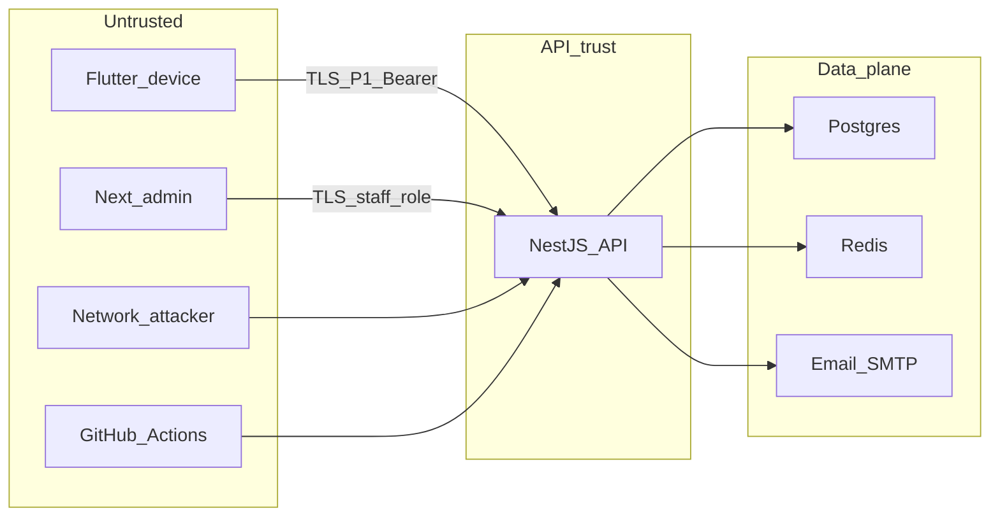

# Threat model

Tài liệu sống — `SEC-P0-001`. Catalog kiểm soát: [security.md](security.md). Review trước phát hành: [security-review.md](../process/security-review.md).

Cập nhật khi thêm bề mặt (endpoint, client, bên thứ ba) hoặc trước gate phase. Không nhét payload exploit / PoC tấn công vào repo.

## Quy ước

- Phương pháp: **STRIDE** (Spoofing, Tampering, Repudiation, Information disclosure, Denial of service, Elevation of privilege).
- Phase 0 = as-built (code hiện tại). Phase 1 = planned (task ID, chưa ship).
- Mitigation ghi control đã có **hoặc** task còn mở. Không bịa đối tác, region, hay IAP.
- Local compose không phải production.

## Actor

| Actor | Mô tả |
|---|---|
| End user | Chủ tài khoản trên Flutter. |
| Staff admin | Nhân viên nội bộ; role `staff` trên cùng API. Không phải user. |
| Attacker mạng | Không auth; quét API, giả origin, brute-force (P1). |
| Attacker thiết bị | Máy mất / mượn; đọc số dư, session trên client. |
| Staff độc hại / tài khoản staff lộ | Tra cứu PII ngoài nhu cầu hỗ trợ. |
| Developer local | Máy dev, credential compose. |
| CI | GitHub Actions; đọc repo, secret CI khi có. |

Ngoài P0/P1: bank partner (Phase 6), crash SaaS (`INF-P1-001` / DECISIONS-OPEN #9).

## Trust boundaries

- Device / admin / internet → API: TLS (staging/prod). Local HTTP chấp nhận được.
- Cùng API cho mobile và admin; phân tách bằng role, không bằng host riêng.
- API → Postgres / Redis / SMTP: mạng nội bộ hoặc secret URL; không lộ ra client.
- Compose local (`:5434`, Redis không auth, Mailhog) **không** deploy ra internet.
- CI không trỏ prod DB ([environments.md](../infrastructure/environments.md)).

## Asset

Khớp [security.md](security.md) và [data-model.md](data-model.md).

| Asset | Ví dụ | Ghi chú |
|---|---|---|
| Dữ liệu tài chính | GD, số dư derived, ví, FX | Prisma đã có; CRUD Phase 1 |
| PII | `User.email`, tên (P1 hồ sơ) | Không log đầy đủ |
| Session / secret | Bearer, cookie, JWT, DB URL | Session schema hoãn `BE-P1-002` |
| Device lock | PIN / biometric | Client, `MOB-P1-001` |
| Bank token | — | Phase 6; chưa có |

## Bề mặt Phase 0 (as-built)

Chỉ những gì đang chạy.

| Surface | Ghi chú |
|---|---|
| `GET /api/health` | Unauth. Trả `status`, `service`, `timestamp`, `database` up/down. |
| Nest `:4000` | Helmet, CORS `CORS_ORIGINS`, ValidationPipe whitelist + `forbidNonWhitelisted`. Prefix `/api`. |
| Compose Postgres `:5434` | User/password dev `freeva`/`freeva`. Chỉ local. |
| Redis `:6379` | Không AUTH trên compose. Chỉ local. |
| Mailhog `:1025` / `:8025` | Fake SMTP + UI. Không dùng prod. |
| Web admin `:3001` | Placeholder; fetch health. Chưa auth staff. |
| Flutter shell | Splash + home. Chưa gọi API. |
| Logger Pino | Redact `req.headers.authorization`, `req.headers.cookie`, `email`, `amountMinor`, `password`, `token`. Checklist formal: `SEC-P0-003`. |
| Git / CI / `.env.example` | Secret không commit ([secrets.md](../infrastructure/secrets.md)). Prod secret manager TBD. |
| OpenAPI | Public trong repo; Phase 0 chỉ health. |
| Prisma schema | Bảng User/ví/GD đã migrate local; không có HTTP CRUD. |

## Bề mặt Phase 1 (planned)

Chưa implement. Gắn task.

| Surface | Task |
|---|---|
| Đăng ký, login email, verify, reset password | `BE-P1-001` |
| Session, rate limit login/OTP, revoke | `BE-P1-002` |
| Google/Apple OAuth (Should) | `BE-P1-003` |
| PIN / biometric lock app | `MOB-P1-001` |
| CRUD ví + số dư ban đầu | `BE-P1-004`, `MOB-P1-003` |
| CRUD GD thu/chi/transfer cân bằng | `BE-P1-005`, `MOB-P1-004`, `QA-P0-002` |
| Danh mục | `BE-P1-006`, `MOB-P1-005` |
| Báo cáo / search | `BE-P1-007`, `BE-P1-008` |
| Sync queue, idempotency `clientId` | `BE-P1-009`, `MOB-P1-008` |
| Export JSON + xóa tài khoản | `BE-P1-010` |
| Ẩn số dư khi nền; cảnh báo thiết bị mới (Should) | `MOB-P1-009` |
| Tra cứu tài khoản staff (không dashboard KD) | `WA-P0-002` |
| Crash monitoring staging | `INF-P1-001` |
| Security test trước store | `SEC-P1-001` |
| Audit schema | `BE-P0-004` |

Auth: Bearer (`/api/v1` khi gắn Phase 1). Mobile không nhúng API secret.

## STRIDE

| ID | Cat | Surface | Threat | Mitigation |
|---|---|---|---|---|
| T-S01 | S | API P1 | Giả danh user (credential stuffing, session đánh cắp) | Chưa auth P0. P1: hash mật khẩu (Argon2id hoặc bcrypt cost cao), rate limit, session revoke — `BE-P1-001`, `BE-P1-002`. |
| T-S02 | S | Mobile | Mở app trên máy người khác | `MOB-P1-001` PIN/biometric. P0: chưa lock. |
| T-S03 | S | Admin | Giả staff | Role `staff` ≠ user; chưa có login staff P0. `WA-P0-002` + auth staff. |
| T-T01 | T | CRUD GD P1 | Sửa số tiền / transfer lệch / IDOR `userId` | Isolation theo `userId`. Transfer hai leg cân bằng — `BE-P1-005`, `QA-P0-002`. ValidationPipe đã chặn field lạ P0. |
| T-T02 | T | Sync P1 | Trùng hoặc ghi đè GD khi offline | `clientId` unique `(userId, clientId)`, `version` — `BE-P1-009`. Rủi ro R2. |
| T-T03 | T | Compose | Đổi data local nếu port bind máy | Chấp nhận local. Không bind compose ra internet; không trỏ local vào prod DB. |
| T-R01 | R | API / admin | Thao tác PII không truy vết | `BE-P0-004` audit schema. Staff tra cứu PII bắt buộc audit ([security.md](security.md)). |
| T-R02 | R | Export / xóa TK | User phủ nhận yêu cầu xóa / xuất | `BE-P1-010` + audit event khi có `BE-P0-004`. |
| T-I01 | I | `GET /api/health` | Lộ DB up/down (recon) | Chấp nhận P0 (ops local). Review ẩn chi tiết trước staging công khai. |
| T-I02 | I | Logger | Email, token, số tiền, số TK trong log | Pino redact paths (`BE-P0-003`). Checklist: `SEC-P0-003`. Không log số dư / email đầy đủ. |
| T-I03 | I | Analytics | PII trong event | Catalog cấm email/số dư/số TK — `MOB-P0-004`. |
| T-I04 | I | Mobile | Số dư lộ khi app nền / screenshot | `MOB-P1-009`. |
| T-I05 | I | Export | File xuất chứa PII trên thiết bị mất | `BE-P1-010` + app lock. Privacy: [privacy-compliance.md](privacy-compliance.md). |
| T-D01 | D | `GET /api/health` | Flood health / mở connection DB | P0: chấp nhận local. P1 staging: rate limit / tách liveness không đụng DB nếu cần. |
| T-D02 | D | Login P1 | Brute-force / OTP spam | `BE-P1-002` rate limit login/OTP. |
| T-E01 | E | Admin | Staff thấy dữ liệu user hoặc dashboard KD | Staff ≠ user. `WA-P0-002` least privilege; **không** dashboard kinh doanh P0. |
| T-E02 | E | API P1 | User A đọc/ghi resource user B | Mọi query user-owned lọc `userId`. OpenAPI + guard Phase 1. |

## Ngoài phạm vi P0/P1

- Kết nối ngân hàng / bank token (Phase 6; cần DPA + threat model RBAC).
- AI / OCR (Phase 5).
- CRDT; sync MVP = queue + last-write-wins ([sync.md](sync.md)).
- Pentest nội bộ bằng payload trong git ([security-review.md](../process/security-review.md)).
- Web consumer (không phải admin).

## Rủi ro dư

| Mục | Xử lý |
|---|---|
| `GET /api/health` unauth + `database` | Chấp nhận P0. Cắt hoặc tách endpoint trước staging public. |
| Redis compose không AUTH | Chỉ local. Prod: AUTH + không expose port. |
| Region dữ liệu TBD | DECISIONS-OPEN #5. |
| Crash SaaS TBD | DECISIONS-OPEN #9; `INF-P1-001`. |
| `security@` TBD | DECISIONS-OPEN #10. |
| Sync trùng GD | RISKS R2 — `BE-P1-009`. |
| PDPD / store reject | RISKS R3 — `PRD-P0-002`, export/xóa trước phát hành. |
| Checklist PII log chưa formal | `SEC-P0-003`. |
| Audit chưa có schema | `BE-P0-004`. |

## Cách cập nhật

1. Thêm hàng surface (P0 as-built hoặc P1+ planned).
2. Thêm hoặc sửa ID STRIDE; gắn mitigation / task.
3. Nếu control catalog đổi: sửa [security.md](security.md).
4. PR `SEC-*` / auth / export / xóa TK ghi rõ đã rà threat model ([pr-review.md](../process/pr-review.md)).
