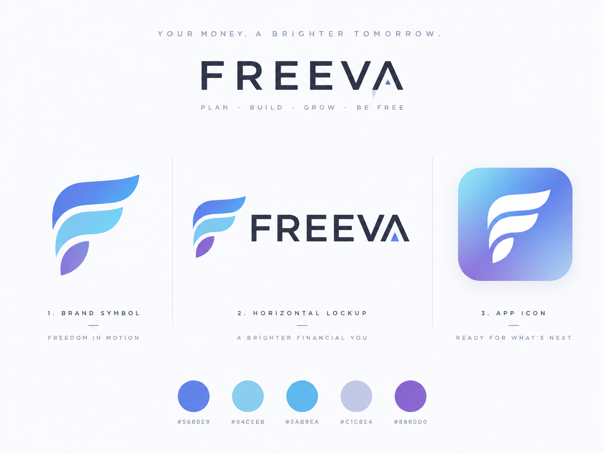
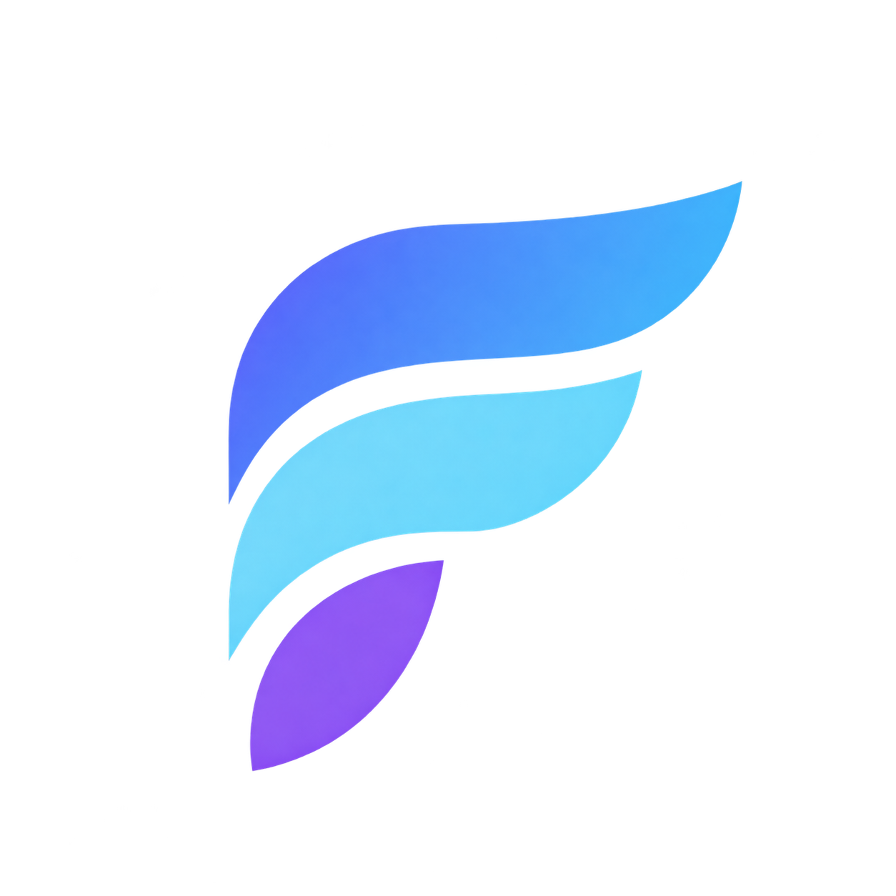
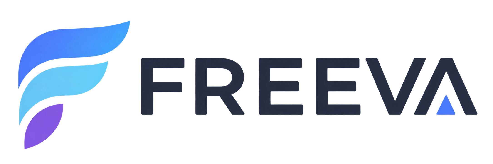

# Brand / UI design system

Board chính thức: [ui-design-system.png](ui-design-system.png).

Token màu kỹ thuật: [palette.md](palette.md) · nguồn hex: [`packages/design-tokens`](../../packages/design-tokens/).

Không copy UI Facebook/Timelikes. UI sản phẩm chỉ dùng token brand/semantic — không hardcode hex trong widget/component.

## Tên và thông điệp

| Vai trò | Nội dung |
|---|---|
| Wordmark | **FREEVA** (all-caps, sans-serif hình học; chữ **A** có tam giác accent thay thanh ngang) |
| Tagline chính | YOUR MONEY. A BRIGHTER TOMORROW. |
| Tagline phụ | PLAN · BUILD · GROW · BE FREE |

## Logo

Ba biến thể trên board — dùng đúng file PNG dưới đây; giữ tỷ lệ, khoảng trống và màu; không tự vẽ lại bằng icon generic. Chưa có SVG vector trong repo.

| Biến thể | File | Caption trên board |
|---|---|---|
| **Brand symbol** | [freeva-brand-symbol.png](freeva-brand-symbol.png) — F stylized, ba nét cong (xanh → cyan → tím), nền đen | FREEDOM IN MOTION |
| **Horizontal lockup** | [freeva-logo-lockup.png](freeva-logo-lockup.png) — symbol + wordmark FREEVA (chữ A có tam giác accent) | A BRIGHTER FINANCIAL YOU |
| **App icon** | [freeva-app-icon.png](freeva-app-icon.png) — symbol trắng/glass trên gradient xanh → tím | READY FOR WHAT'S NEXT |

### Brand symbol

### Horizontal lockup

### App icon

## Palette (tóm tắt board)

Năm màu brand trên board (chi tiết dùng/cấm: [palette.md](palette.md)):

| Hex | Token |
|---|---|
| `#5680E9` | `color.brand.primary` |
| `#84CEEB` | `color.brand.highlight` |
| `#5AB9EA` | `color.brand.secondary` |
| `#C1C8E4` | `color.brand.muted` |
| `#8860D0` | `color.brand.accent` |

`#84CEEB` và `#C1C8E4` **không** dùng làm màu chữ.

## Splash mobile — MOB-P1-010

Copy splash được chốt riêng: **FREEVA** / *Your money. Your freedom.* (giữ
nguyên ở vi/en). Tagline trên board và các asset gốc vẫn giữ nguyên.
Splash Flutter dài 1,8 giây trên gradient brand toàn màn hình: mảnh tím xuất
hiện trước, mảnh cyan trượt lên nhẹ, mảnh xanh hoàn thiện F; halo nhẹ rồi
thu nhỏ 4,5% và fade out sang home. Dùng mask theo khoảng trong suốt trên PNG
gốc, không vẽ lại symbol. Khi bật giảm chuyển động, hiển thị logo/copy tĩnh
và vẫn chuyển màn sau 1,8 giây.

Tinh chỉnh theo ảnh tham chiếu splash: gradient nhiều lớp sáng ở góc trên phải
và vùng trung tâm, tím ở góc dưới trái; symbol lớn theo chiều rộng màn hình,
halo mềm và hai vòng cung mờ. Wordmark navy giãn chữ, tagline đứng màu text
muted; mọi màu lấy từ token hiện có. Giữ nguyên PNG và motion 1,8 giây.
