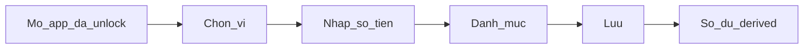

# Use cases — ghi chi ưu tiên

Task `PRD-P0-001`. Actor mặc định: [P1](personas.md) (knowledge worker, ngân hàng + ví điện tử). Implement Phase 1: [BE-P1-005](../../tasks/phase-01.md), [MOB-P1-004](../../tasks/phase-01.md). Invariant: [ADR 006](../architecture/adr/006-money-and-fx.md), [data-model](../architecture/data-model.md). Analytics: [analytics-events.md](analytics-events.md).

Không nhân bản roadmap. Thu và chuyển khoản dùng cùng invariant — chưa viết UC đầy đủ (cuối file).

## Quy tắc ghi chi

Chỉ trích rule đã chốt. Không `double` / `float` cho tiền. Không log số dư, số tài khoản, email đầy đủ.

| Rule | Chi tiết |
|---|---|
| Loại | `type=expense` |
| Số tiền | `amountMinor` **âm**, integer; VND `minorDigits=0` |
| Số dư | derived: `initialBalanceMinor` + tổng GD chưa `deletedAt` |
| Ngày | `occurredOn` = calendar date theo `User.timezone` (mặc định `Asia/Ho_Chi_Minh`), không UTC wall-clock |
| Kỳ báo cáo | theo `fiscalMonthStartDay` (1–28) |
| Danh mục | bắt buộc với chi; danh mục con và “dùng gần đây” (Module 5) |
| Ví `cash` / `bank` / `ewallet` | chi làm số dư dương giảm |
| Ví `credit` | chi làm derived **âm hơn** (nợ tăng). Thanh toán thẻ **không** phải expense — là transfer |
| Ghi chú | optional |
| Nhãn | Should — không bắt buộc UC |
| Xóa | soft-delete `deletedAt`. Khôi phục vừa xóa = Should (nhắc UC-EXP-03, không Must) |

Luồng tối thiểu sau khi unlock:

---

## UC-EXP-01 — Ghi chi nhanh ví thanh toán

Ghi chi trên ví `cash`, `bank`, hoặc `ewallet` với ít thao tác. Workstream UX: tối ưu thời gian tạo giao dịch hằng ngày. Mục tiêu: dưới 15 giây sau khi unlock.

### Actor / trigger

P1 vừa trả bằng chuyển khoản, ví điện tử, hoặc tiền mặt. Mở app để ghi ngay.

### Tiền điều kiện

- Đã đăng nhập; app đã unlock (PIN/sinh trắc nếu bật).
- Có ít nhất một ví `cash` \| `bank` \| `ewallet` chưa `archivedAt`.
- Có danh mục chi (bộ mặc định VN hoặc user tạo).

### Luồng chính

1. Mở màn ghi giao dịch (lối tắt từ tổng quan nếu có).
2. Loại mặc định = chi.
3. Ví mặc định = ví dùng gần đây hoặc ví mặc định user; đổi được.
4. Nhập số tiền (VND, số nguyên đồng). UI không dùng `double` cho tính toán.
5. Chọn danh mục — ưu tiên danh mục dùng gần đây; có thể mở cây đầy đủ.
6. `occurredOn` mặc định = hôm nay theo TZ user. Ghi chú optional.
7. Lưu. Client gửi `amountMinor` âm, `type=expense`, `clientId` để idempotency.

### Ngoại lệ

- Chưa có ví: hướng tạo ví trước (onboarding), không lưu GD mồ côi.
- Số tiền 0 hoặc dương trên form chi: không lưu; user phải nhập số dương trên UI, hệ thống lưu âm.
- Ví `credit`: không dùng luồng này — [UC-EXP-02](#uc-exp-02).
- Mất mạng: hàng đợi sync (Should/MVP queue) — không tạo trùng khi retry (`clientId`).

### Tiêu chí chấp nhận

- GD `type=expense`, `amountMinor` < 0, `currencyCode` khớp ví.
- Số dư ví = `initialBalanceMinor` + tổng GD chưa xóa; giảm đúng `|amountMinor|`.
- `occurredOn` = ngày dương lịch TZ user, không lệch ngày vì UTC.
- Sự kiện `transaction_created` (property `type=expense`); không PII số dư/số TK.

---

## UC-EXP-02 — Ghi chi thẻ tín dụng

Chi trên ví `credit` làm **nợ tăng**. Không trừ ví tiền mặt / ngân hàng / ví điện tử. Thanh toán sao kê thẻ là transfer (ngoài UC này).

### Actor / trigger

P1 vừa chi bằng thẻ tín dụng (online hoặc POS).

### Tiền điều kiện

- Có ví `type=credit` chưa lưu trữ. Optional: `creditLimitMinor`, `statementCloseDay`, `paymentDueDay` (không chặn ghi chi nếu trống).
- Có danh mục chi.

### Luồng chính

1. Mở ghi chi; chọn ví thẻ tín dụng.
2. Nhập số tiền, danh mục, `occurredOn` (mặc định hôm nay).
3. Lưu `type=expense`, `amountMinor` âm, `accountId` = ví credit.

### Ngoại lệ

- User chọn nhầm ví thanh toán: số dư ví đó giảm — đây là UC-EXP-01, không tự chuyển sang credit.
- Thanh toán thẻ (chuyển từ ngân hàng/ví sang thẻ): **cấm** lưu thành expense trên thẻ. Phải là hai leg `type=transfer`, cùng `transferGroupId`, tổng cùng currency = 0. Chưa viết UC transfer.
- Chi vượt hạn mức: Phase 1 không chặn bắt buộc; hạn mức là thông tin ví, không phải invariant ghi chi.

### Tiêu chí chấp nhận

- Số dư derived ví credit **âm hơn** đúng `|amountMinor|` (nợ tăng).
- Số dư các ví `cash`/`bank`/`ewallet` **không** đổi.
- Cùng rule tiền/TZ/danh mục như UC-EXP-01.
- `transaction_created` `type=expense`.

---

## UC-EXP-03 — Ghi chi muộn và sửa/xóa

Backdate `occurredOn`, sửa số tiền hoặc danh mục, soft-delete. Báo cáo kỳ tài chính phải khớp sau thay đổi. Trust: P1 sửa được sai sót thay vì bỏ app.

### Actor / trigger

P1 nhớ chi hôm trước; hoặc vừa ghi nhầm số tiền / danh mục / ví.

### Tiền điều kiện

- Có ví và danh mục như UC-EXP-01 hoặc UC-EXP-02.
- Với sửa/xóa: GD chi tồn tại, `deletedAt` null, thuộc user.

### Luồng chính — ghi muộn

1. Mở ghi chi.
2. Đổi `occurredOn` sang ngày trong quá khứ (calendar date TZ user). Không dùng timestamp UTC để suy ngày.
3. Số tiền, ví, danh mục như UC-EXP-01 hoặc 02.
4. Lưu. GD thuộc kỳ báo cáo chứa `occurredOn` theo `fiscalMonthStartDay`.

### Luồng chính — sửa

1. Mở chi tiết GD chi.
2. Sửa `amountMinor` (vẫn âm), `categoryId`, `accountId`, `occurredOn`, ghi chú.
3. Lưu; `version` tăng. Số dư mọi ví liên quan (ví cũ và mới nếu đổi ví) tính lại từ GD chưa xóa.

### Luồng chính — xóa

1. Xóa GD → `deletedAt` set. GD không còn trong số dư và báo cáo.
2. Khôi phục vừa xóa (Should): xóa `deletedAt`; số dư trở lại. Không bắt Must Phase 1.

### Ngoại lệ

- `occurredOn` tương lai: cho phép hoặc chặn là chi tiết UI Phase 1; nếu cho phép, kỳ báo cáo vẫn theo `occurredOn`.
- Sửa GD đã xóa: phải khôi phục trước (nếu có Should) hoặc không sửa.
- Đổi ví từ credit sang bank (hoặc ngược): số dư cả hai ví derived đúng; không tạo transfer ngầm.
- Không hard-delete trong luồng user.

### Tiêu chí chấp nhận

- Ghi muộn: GD xuất hiện đúng kỳ (`fiscalMonthStartDay`), không lệch vì TZ.
- Sau sửa: báo cáo thu/chi/danh mục/ví khớp nguồn; số dư derived đúng.
- Sau xóa: không còn trong tổng chi kỳ; số dư tăng lại `|amountMinor|`.
- `transaction_created` (ghi muộn) / `transaction_edited` / `transaction_deleted`. Không PII.

---

## Cùng invariant, chưa viết UC

- **Thu:** `type=income`, `amountMinor` dương. Cùng TZ, danh mục, số dư derived.
- **Chuyển khoản:** hai `Transaction` `type=transfer`, cùng `transferGroupId`; cùng currency thì tổng `amountMinor` = 0; khác currency thì mỗi leg có `fxQuoteId` đã chốt. Cân bằng enforce ở `BE-P1-005`. Thanh toán thẻ = transfer, không phải chi.

## Ngoài phạm vi (các UC trên)

OCR, import file/ngân hàng, split bill, **multi-user / shared wallet**, giao dịch định kỳ, ảnh hóa đơn, FX tự động, copy GD, chống trùng nâng cao, đối soát thủ công.

Category hoặc tag “Chi tiêu gia đình” nếu có chỉ là phân loại trên **một** user — không phải [module 16](modules/16-family.md).
